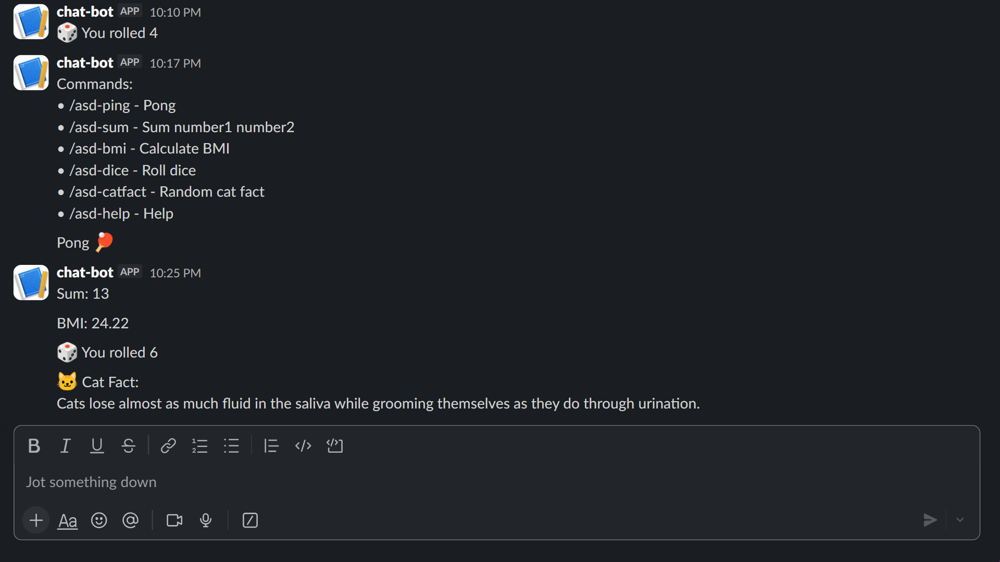

# Slack Bot (Nest Deployment)

I built and deployed a Slack bot on a Nest server that runs 24/7 using Node.js and systemd.

The bot includes several slash commands:

## /asd-ping

Checks if the bot is online and responding.

## /asd-sum

Calculates the sum of two numbers.

## /asd-bmi

Calculates Body Mass Index from weight and height.

## /asd-dice

Rolls a random dice value.

## /asd-catfact

Fetches a random cat fact using an external API.

## /asd-help

Displays all available commands.

The project demonstrates a full deployment workflow:

GitHub -> Node.js Slack Bot -> Linux Server (Nest) -> 24/7 Production Service using systemd and Socket Mode.

During development, I learned:

* Slack API and Slash Commands
* Slack Bolt framework
* Socket Mode integration
* Linux server management
* systemd service deployment
* environment variable configuration
* debugging production deployment issues

The bot is now fully deployed and runs continuously on the server with automatic restart support.

# Install the Bot

Use the link below to install the Slack bot into your workspace:

[https://hackclub.enterprise.slack.com/archives/D0B8XCVRG6L]

Screenshots:
 
